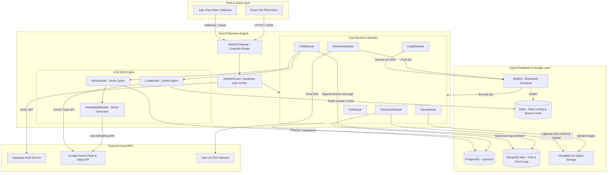
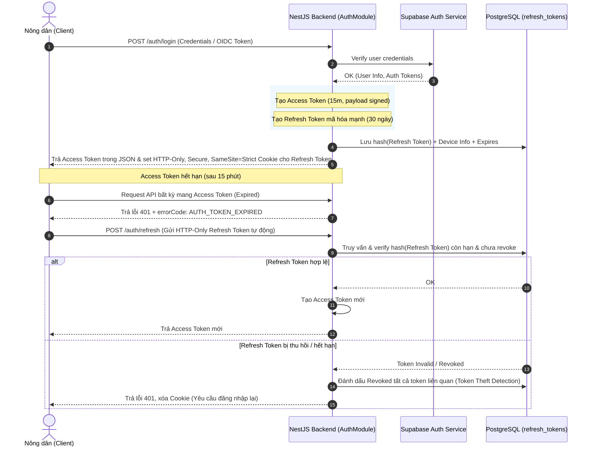
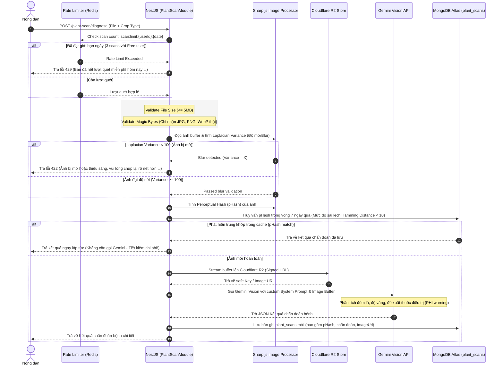
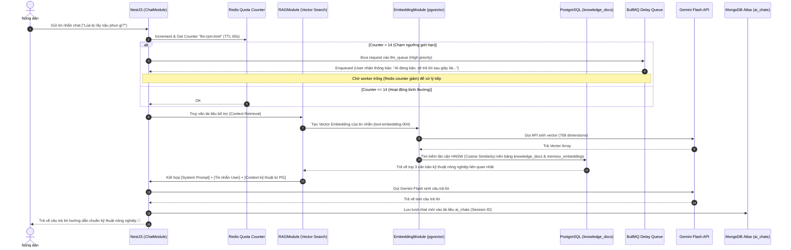
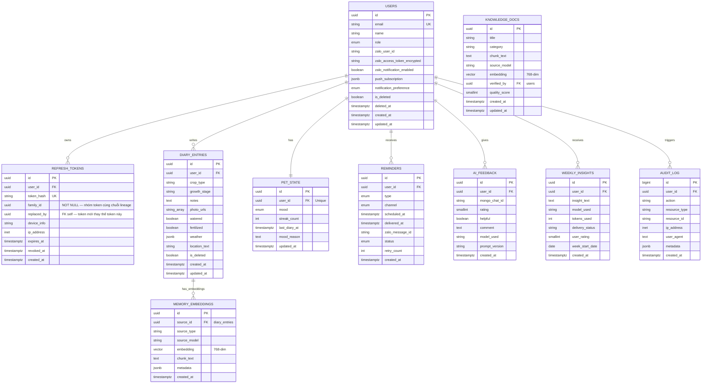

# FarmDiaries AI — Core Architecture Design Document (ADD)
### System Design · Hybrid Database Orchestration · AI Pipeline · Security Blueprint

| Thuộc tính | Giá trị |
|---|---|
| **Dự án** | FarmDiaries AI (SDN392 Capstone Project) |
| **Tài liệu** | Core Architecture Design Document (ADD) |
| **Phiên bản** | v1.0 (Align với Technical Blueprint v6.0) |
| **Tác giả** | Team 4 - Antigravity Agentic Assistant |
| **Trạng thái** | Active · specs folder |

---

> **MongoDB-first update:** This ADD still contains older hybrid PostgreSQL/pgvector diagrams. For new backend implementation, use MongoDB Atlas as the primary database and Atlas Vector Search for RAG as specified in `openspec/specs/mongodb_stack_analysis.md`.

## 1. Bản đồ tổng quan Kiến trúc Hệ thống (System Architecture)

Hệ thống tuân thủ mô hình **Decoupled Modern Web PWA / Hybrid Cloud**, kết nối thông qua RESTful API tốc độ cao viết trên NestJS. Dưới đây là sơ đồ luồng dữ liệu và tương tác giữa các thành phần:



---

## 2. Request Lifecycle & Trình tự xử lý chính (Sequence Diagrams)

### 2.1 Luồng Xác thực & Quay vòng Access/Refresh Token (JWT Cookie Rotation)
Hệ thống sử dụng **Supabase Auth** để quản lý Identity, nhưng tự xoay vòng JWT thông qua HTTP-Only Cookie nhằm đảm bảo tính an toàn tối đa cho môi trường Web/PWA:



---

### 2.2 Quy trình Quét bệnh cây trồng (Plant Scan Validation & Vision Pipeline)
Để tránh spam API và đảm bảo chất lượng chẩn đoán từ ảnh chụp của nông dân, hệ thống triển khai pipeline kiểm chuẩn hình ảnh vô cùng nghiêm ngặt:



---

### 2.3 Luồng Trò chuyện RAG & Bảo vệ Quota (Gemini API Free-Tier Guard)
Cơ chế bảo vệ Quota miễn phí (15 RPM) của Gemini, đảm bảo người dùng chat không bao giờ bị nghẽn thông qua hàng đợi Redis và BullMQ:



---

## 3. Cấu trúc Hybrid Database & Sơ đồ Thực thể (ERD)

### 3.1 PostgreSQL - Mô hình quan hệ chính (ERD)

Các bảng liên quan đến ACID, bảo mật, nhật ký nông nghiệp và Vector Search lưu tại PostgreSQL:



---

### 3.2 MongoDB - Mô hình Document phi cấu trúc (Secondary Collections)

Tách biệt các dạng dữ liệu tần suất ghi cực cao, schema linh động và có thể lưu trữ ngắn hạn:

#### 1. Collection `ai_chats` (Lưu lịch sử hội thoại có TTL 90 ngày)
*   **Mục đích:** Lưu tin nhắn dạng mảng lồng nhau, phục vụ giao diện chat dạng thread/session.
*   **Index đề xuất:**
    *   `{ userId: 1, createdAt: -1 }` (Hiển thị danh sách hội thoại của người dùng)
    *   `{ sessionId: 1 }` (Độc nhất, phục vụ lấy chi tiết cuộc hội thoại)
    *   `{ createdAt: 1 }` với thuộc tính `expireAfterSeconds: 7776000` (Tự động xóa tin nhắn cũ sau 90 ngày để tránh làm phình to đĩa).

#### 2. Collection `user_events` (Nhật ký hành vi nông dân với TTL 30 ngày)
*   **Mục đích:** Thu thập dữ liệu phục vụ nghiên cứu hành vi nông dân và cải tiến sản phẩm.
*   **Index đề xuất:**
    *   `{ userId: 1, createdAt: -1 }`
    *   `{ eventType: 1, createdAt: -1 }`
    *   `{ createdAt: 1 }` với thuộc tính `expireAfterSeconds: 2592000` (Dọn dẹp tự động sau 30 ngày).

#### 3. Collection `plant_scans` (Bản ghi chi tiết lịch sử chẩn đoán hình ảnh)
*   **Mục đích:** Lưu trữ chi tiết các ca bệnh thực tế được quét từ camera.
*   **Index đề xuất:**
    *   `{ userId: 1, createdAt: -1 }` (Lịch sử quét của người dùng)
    *   `{ pHash: 1 }` (Truy vết ảnh trùng lặp để phục vụ bộ đệm cache kết quả 7 ngày).

---

## 4. Kiến trúc phân lớp Backend NestJS (Clean Layered Architecture)

Backend được thiết kế chặt chẽ theo tư tưởng **Hexagonal / Clean Architecture**, phân tách rõ ràng trách nhiệm từ ngoài vào trong:

```
+-------------------------------------------------------------------------+
|                              LAYER 1: GATEWAY                           |
|       (Controllers, WebSockets, Zalo Webhooks, PWA Subscriptions)       |
+------------------------------------+------------------------------------+
                                     |
                                     |  DTOs & HTTP Requests
                                     v
+-------------------------------------------------------------------------+
|                            LAYER 2: APPLICATION                         |
|     (Guards, Pipes, Interceptors, Validation, Exception Filters)       |
+------------------------------------+------------------------------------+
                                     |
                                     |  Validated Data & User Context
                                     v
+-------------------------------------------------------------------------+
|                              LAYER 3: DOMAIN                            |
|             (Business Services, Pet Mood Rules, RAG Prompts)            |
+------------------------------------+------------------------------------+
                                     |
                                     |  Repository Interfaces
                                     v
+-------------------------------------------------------------------------+
|                          LAYER 4: INFRASTRUCTURE                        |
|  (TypeORM PostgreSQL, Mongoose MongoDB, BullMQ, Redis, CF R2, Gemini)   |
+-------------------------------------------------------------------------+
```

### 4.1 Quy tắc Tổ chức Module Chuẩn
Mỗi module bên trong [src/modules](file:///d:/coding/farmdiary/project/backend/src/modules) bắt buộc phải tuân thủ phân rã file như sau:
1.  `dto/`: Nơi định nghĩa các đối tượng truyền dữ liệu (DTO) với thư viện `class-validator` để kiểm chuẩn payload đầu vào từ client.
2.  `entities/` hoặc `schemas/`: Thực thể TypeORM (cho Postgres) hoặc Schema Mongoose (cho MongoDB).
3.  `controllers/`: Nơi xử lý router HTTP, định nghĩa Swagger, áp dụng Guards phân quyền.
4.  `services/`: Nơi chứa toàn bộ nghiệp vụ cốt lõi (Business Logic), không trực tiếp phụ thuộc vào cơ chế truyền tải HTTP.
5.  `module.ts`: Khai báo import, export rõ ràng các Controller và Service.

---

## 5. Kế hoạch Phòng vệ & Mô hình An ninh (Security Threat Model)

Hệ thống đặt bảo mật làm mặc định để bảo vệ tối đa dữ liệu của nông dân và các tài nguyên Cloud giá trị:

### 5.1 Phòng chống bypass header (Magic Bytes Validation)
Kẻ tấn công có thể đổi đuôi file `.exe` hay `.sh` thành `.jpg` hòng tải mã độc lên R2. Hệ thống kiểm duyệt kép buffer ảnh:
1.  **Multer File Extension Filter:** Kiểm tra Mime-type khai báo bởi client.
2.  **Magic Bytes Verification:** Đọc nội dung nhị phân (Binary Header) của buffer ảnh bằng thư viện `file-type`. Chỉ cho phép luồng chạy tiếp nếu byte mở đầu tương thích với định dạng JPG, PNG hoặc WebP thực thụ.

### 5.2 Ràng buộc quyền truy cập Object Storage (Cloudflare R2)
*   **Private Bucket:** Toàn bộ ảnh nhật ký canh tác (`diary_entries.photo_urls`) và ảnh quét bệnh (`plant_scans.imageUrl`) được lưu trữ tại private bucket của Cloudflare R2.
*   **Pre-signed URLs:** Backend không trả về URL tĩnh của ảnh. Thay vào đó, backend sử dụng thư viện `@aws-sdk/s3-request-presigner` để sinh các URL ký độc quyền có **thời gian hết hạn ngắn (TTL = 1 giờ)**. Sau 1 giờ, các liên kết này hoàn toàn vô hiệu, ngăn chặn rò rỉ dữ liệu nông trại ra internet.

### 5.3 Ngăn ngừa Tấn công chiếm dụng phiên (Token Theft Detection)
Nếu kẻ tấn công đánh cắp được `Refresh Token` từ máy người dùng:
*   Mỗi khi một Refresh Token được sử dụng để lấy Access Token mới, backend tạo token mới và đặt `replaced_by = new_token.id` trên token cũ, sau đó đánh dấu token cũ là `revoked_at = now()`.
*   **Token Theft Detection Logic:** Nếu backend phát hiện một Refresh Token cũ (có `revoked_at IS NOT NULL` hoặc đã có `replaced_by`) đột ngột được gửi lại hệ thống, đây là dấu hiệu chắc chắn bị đánh cắp. Backend kích hoạt **Token Theft Alarm** thông qua `family_id`:
    ```sql
    -- Tìm và revoke toàn bộ token cùng lineage (cùng family_id)
    UPDATE refresh_tokens
    SET revoked_at = NOW()
    WHERE family_id = :compromised_family_id
      AND revoked_at IS NULL;
    ```
*   Kết quả: Thu hồi ngay lập tức **toàn bộ các token cùng family** (không revoke token của các phiên khác), bắt buộc đăng nhập lại trên mọi thiết bị trong cùng chuỗi đó.

---

## 6. Giải thuật AI & Điều phối Chi phí (Cost Orchestration)

Vì dự án capstone ưu tiên sử dụng các gói miễn phí (Gemini API Free Tier), thuật toán phân phối tải thông minh được thiết lập nhằm tránh lỗi nghẽn dịch vụ `429 Too Many Requests`:

### 6.1 Giải thuật phân bổ tải Weekly Insight Cron (Chủ nhật 6:00 AM)
Nếu có $N$ người dùng hoạt động trong tuần, việc tạo báo cáo insight đồng thời sẽ gây nghẽn API ngay lập tức. Thuật toán phân bổ thời gian (Delay Spreading Algorithm) được áp dụng để rải đều tải trong vòng 4 tiếng (14,400 giây):

$$\text{Delay}_i = i \times \left( \frac{14400 \times 1000}{N} \right) \text{ miliseconds}$$

*Trong đó:*
*   $i$: Thứ tự của người dùng hoạt động trong mảng danh sách người dùng ($0 \le i < N$).
*   Công thức này giúp đảm bảo tần suất gọi API Gemini Flash luôn giữ ở mức an toàn dưới **10 RPM**, loại bỏ hoàn toàn khả năng chạm ngưỡng giới hạn của Free Tier (15 RPM).

### 6.2 Cấu hình Hàng đợi Phân cấp Ưu tiên (BullMQ Priority Queue)
Sử dụng BullMQ để phân tầng ưu tiên xử lý các request gọi LLM:

| Thứ hạng | Tác vụ | Ưu tiên (Priority) | Queue | Trải nghiệm người dùng |
|---|---|---|---|---|
| **1** | Trò chuyện trực tiếp (AI Chat) | 1 (High) | `llm_queue` | Xử lý ngay lập tức (< 3s) |
| **2** | Quét chẩn đoán bệnh (Plant Scan) | 2 (Medium) | `llm_queue` | Phản hồi trong vòng 5-10s |
| **3** | Nhắc nhở công việc (Reminder) | 5 (Low) | `reminder_queue` | Chấp nhận độ trễ vài phút |
| **4** | Tổng hợp insight tuần (Weekly Cron) | 10 (Lowest) | `insight_queue` | Chạy nền phân tán trong 4 giờ |

---

*Tài liệu Core Architecture Design Document này là Source of Truth cho quá trình lập trình logic chi tiết của nhóm. Hãy tuân thủ nghiêm ngặt các quy chuẩn thiết kế để đảm bảo sản phẩm Capstone đạt tiêu chuẩn cao nhất.* 🌱
