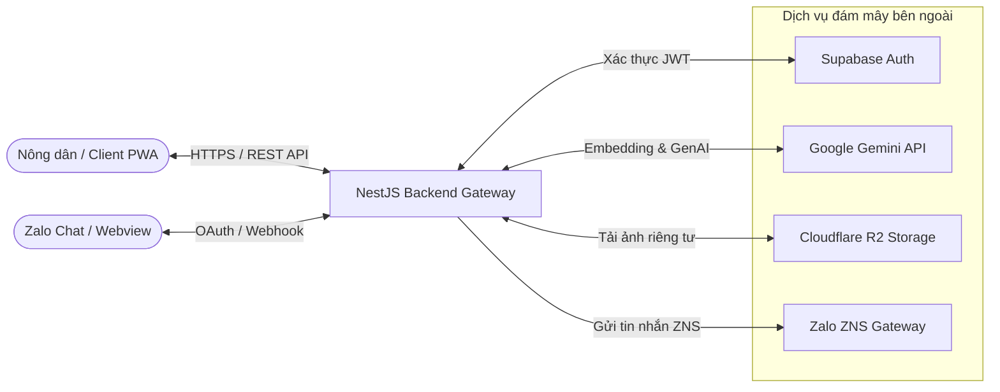

# Slide Deck Outline: FarmDiaries AI (SDN392 Capstone Project)

Tài liệu này phác thảo chi tiết nội dung từng slide để phục vụ cho việc làm slide thuyết trình về dự án **FarmDiaries AI**. Nội dung được biên soạn sát theo cấu trúc source code thực tế (NestJS backend, React PWA frontend) và các tài liệu kiến trúc của dự án.

---

## Slide 1: Đặt Vấn Đề & Tuyên Bố Bài Toán (The Problem Statement)

### 📌 Tiêu đề Slide
**FarmDiaries AI: Trợ lý số đồng hành cùng Nông dân Việt Nam**

### 🎨 Ý tưởng Layout/Visuals
*   **Trái:** Ảnh minh họa ruộng vườn thực tế (lá cây bị bệnh, sổ tay ghi chép lem luốc).
*   **Phải:** Danh sách 3 vấn đề lớn (Pain Points) và Giải pháp (Solution) tương ứng dưới dạng các thẻ (cards) trực quan.

### 📝 Nội dung Slide
*   **Thực trạng & Khó khăn của Nông dân:**
    *   *Quản lý thủ công:* Ghi chép nhật ký canh tác bằng sổ tay giấy, dễ thất lạc, khó tra cứu lịch sử bón phân, tưới nước.
    *   *Chẩn đoán sâu bệnh chậm:* Dựa vào kinh nghiệm cảm quan hoặc chờ chuyên gia, dễ dẫn đến phun sai thuốc hoặc chậm trễ khiến bệnh lây lan.
    *   *Thiếu cảnh báo an toàn:* Không có cơ chế tự động nhắc nhở thời gian cách ly phun thuốc (PHI Warning), gây ảnh hưởng an toàn thực phẩm.
*   **Giải pháp - FarmDiaries AI:**
    *   Số hóa quy trình ghi chép nhật ký qua Progressive Web App (PWA) hỗ trợ chạy ngoại tuyến (Offline-First).
    *   Tích hợp AI Vision (Gemini 1.5 Flash) chẩn đoán bệnh qua ảnh chụp tức thì và tư vấn kỹ thuật nông nghiệp qua Chatbot RAG.
    *   Nhắc nhở thông minh, đồng bộ lịch canh tác qua Zalo OA (ZNS) và thông báo Web Push.

### 🗣️ Speaker Notes
> "Kính thưa Hội đồng, nông nghiệp Việt Nam đang chuyển mình mạnh mẽ sang số hóa. Tuy nhiên, bà con nông dân vẫn gặp rào cản lớn khi quản lý vườn tược bằng sổ tay truyền thống và chẩn đoán sâu bệnh thủ công. Dự án FarmDiaries AI ra đời nhằm giải quyết triệt để vấn đề này. Chúng tôi mang đến một ứng dụng PWA chạy được kể cả khi mất mạng ngoài đồng, tích hợp trí tuệ nhân tạo Gemini để quét bệnh cây trồng tức thì và chatbot tư vấn chuẩn kỹ thuật, cùng hệ thống nhắc nhở tự động qua Zalo OA thân thuộc."

---

## Slide 2: Đội Ngũ Phát Triển & Phân Vai (Team Members & Roles)

### 📌 Tiêu đề Slide
**Đội ngũ dự án & Phân chia công việc (Group 6 / Team 4)**

### 🎨 Ý tưởng Layout/Visuals
*   Chia slide thành 4 cột tương ứng với 4 thành viên (M1, M2, M3, M4).
*   Mỗi cột có avatar, chức danh chính (Role), và các nhiệm vụ cụ thể đảm nhận trong dự án.

### 📝 Nội dung Slide
*   **Thành viên M1 - Project Lead & DevOps / RAG Engineer**
    *   *Nhiệm vụ:* Thiết lập cơ sở hạ tầng Cloud (Cloudflare R2, MongoDB Atlas, pgvector). Thiết lập CI/CD pipeline, chạy kiểm thử tích hợp (Integration Tests). Xây dựng module Embedding & RAG.
*   **Thành viên M2 - Frontend Developer (PWA & State Management)**
    *   *Nhiệm vụ:* Phát triển giao diện React Vite PWA (TypeScript, Tailwind CSS). Cấu hình Redux Toolkit & RTK Query để quản lý state và gọi API. Tích hợp giao diện Chat, quét lá bệnh và cài đặt PWA Web Push.
*   **Thành viên M3 - AI Engineer (Gemini Integration & Safety Guardrails)**
    *   *Nhiệm vụ:* Tích hợp API Google Gemini (Flash & Vision). Thiết kế Prompt Engine cho RAG và chẩn đoán bệnh. Xây dựng bộ lọc an toàn AI (Safety Guardrails), ngăn ngừa ảo tưởng thông tin.
*   **Thành viên M4 - Backend & Security Engineer (Auth & Scheduler)**
    *   *Nhiệm vụ:* Phát triển hệ thống xác thực Supabase Auth & JWT Cookie Rotation. Xây dựng logic nghiệp vụ (Diary CRUD, Pet State Engine). Lập lịch BullMQ & Redis gửi thông báo nhắc nhở qua Zalo OA ZNS.

### 🗣️ Speaker Notes
> "Để hiện thực hóa sản phẩm, đội ngũ 4 thành viên của chúng tôi được phân vai rất rõ ràng theo mô hình phát triển phần mềm hiện đại. M1 chịu trách nhiệm chung về DevOps, hạ tầng Cloud và thuật toán RAG. M2 tập trung tối ưu trải nghiệm người dùng trên thiết bị di động bằng PWA. M3 chịu trách nhiệm huấn luyện prompt và kết nối các dịch vụ AI của Google. M4 hoàn thiện lõi backend NestJS, bảo mật hệ thống và lập lịch nhắc nhở."

---

## Slide 3: Công Cụ & Quy Trình Quản Lý Dự Án (Project Management & Agile Scrum)

### 📌 Tiêu đề Slide
**Quy trình quản trị dự án hiện đại (Jira & Agile Scrum)**

### 🎨 Ý tưởng Layout/Visuals
*   **Trái:** Sơ đồ 5 Sprints của dự án kéo dài từ khởi tạo đến Golive.
*   **Phải:** Ảnh chụp màn hình mô phỏng Jira Board hoặc bảng phân loại task theo độ ưu tiên/nhãn (labels).

### 📝 Nội dung Slide
*   **Công cụ cốt lõi:** Quản lý Backlog và phân công công việc thông qua **Jira** (Project Key: `FARM`).
*   **Quy trình Agile Scrum:**
    *   *Ước lượng:* Sử dụng Story Points (từ 1 SP đến 8 SP) để định lượng khối lượng công việc.
    *   *Phân loại nhãn (Labels):* Gắn thẻ rõ ràng để theo dõi tiến độ (`setup`, `config`, `feature`, `security`, `ai`, `testing`, `devops`).
*   **Lộ trình phát triển qua 5 Sprints:**
    *   **Sprint 1:** Khởi tạo hạ tầng, thiết lập Supabase Auth, thiết kế API Layer (RTK Query).
    *   **Sprint 2:** Hoàn thiện nghiệp vụ lõi (Nhật ký vụ mùa, Thú ảo, nhắc nhở BullMQ).
    *   **Sprint 3:** Tích hợp AI (Gemini Flash, pgvector Search, RAG Module).
    *   **Sprint 4:** Hoàn thiện luồng trò chuyện Chatbot (SSE Streaming, AI Feedback).
    *   **Sprint 5:** Kiểm thử E2E, tối ưu hóa PWA chạy offline và triển khai production.

### 🗣️ Speaker Notes
> "Chúng tôi áp dụng mô hình Agile Scrum một cách nghiêm túc để quản lý dự án. Toàn bộ công việc được phân rã thành các Epic và User Story trên hệ thống Jira. Dự án trải qua 5 Sprint chạy nước rút: từ việc dựng móng cơ sở dữ liệu ở Sprint 1, phát triển tính năng nghiệp vụ ở Sprint 2, đưa AI vào ở Sprint 3 & 4, và tiến hành tối ưu hóa, viết test ở Sprint 5."

---

## Slide 4: Ca Sử Dụng Hệ Thống (Key System Usecases)

### 📌 Tiêu đề Slide
**Các tính năng & Ca sử dụng trọng tâm (Use Case Diagram)**

### 🎨 Ý tưởng Layout/Visuals
*   Sơ đồ Use Case Mermaid/Bong bóng: Trọng tâm là Nông dân (Actor chính) kết nối đến các nhóm tính năng.
*   Sử dụng các icon đại diện cho từng phân hệ (Quyển sổ 📝, Kính hiển vi 🔍, Chatbot 💬, Thú ảo 🐾, Đồng hồ nhắc nhở ⏰).

### 📝 Nội dung Slide
*   **1. Nhật ký số & Quản lý vụ mùa (Diary CRUD):**
    *   Nông dân tạo vườn, bắt đầu vụ mùa và ghi nhật ký hoạt động hàng ngày (tưới nước, bón phân, xịt thuốc). Hệ thống tự đồng bộ thời tiết theo GPS.
*   **2. Trợ lý chẩn đoán sâu bệnh (Plant Scan):**
    *   Chụp ảnh lá cây bệnh $\rightarrow$ Nhận diện bằng AI Vision $\rightarrow$ Nhận kết quả chẩn đoán, đề xuất thuốc điều trị sinh học/hóa học và cảnh báo cách ly (PHI).
*   **3. Trợ lý AI Chat (RAG Chatbot):**
    *   Hỏi đáp kiến thức trồng trọt, phòng bệnh bằng ngôn ngữ tự nhiên. Trợ lý trả lời dựa trên kho tài liệu nông nghiệp chính thống của Việt Nam.
*   **4. Thú ảo đồng hành (Gamification):**
    *   Nuôi thú ảo giúp tăng tương tác. Thú ảo vui vẻ nếu nông dân chăm ghi nhật ký (Streak cao), buồn bã hoặc nhắc nhở nếu nông dân bỏ bê vườn tược.
*   **5. Nhắc nhở thông minh (Reminder System):**
    *   Nhận thông báo tự động giờ tưới cây, phun thuốc qua tin nhắn Zalo OA hoặc PWA Web Push.

### 🗣️ Speaker Notes
> "Đối với nông dân, ứng dụng cung cấp 5 nhóm tính năng cực kỳ thiết thực. Đầu tiên là số hóa nhật ký vườn tược. Thứ hai là dùng camera quét lá để phát hiện bệnh cây trồng trong 3 giây. Thứ ba là trò chuyện trực tiếp với AI để hỏi đáp kỹ thuật. Thứ tư là cơ chế nuôi thú ảo tạo động lực ghi chép mỗi ngày. Và cuối cùng là hệ thống nhắc nhở tự động, đưa thông báo trực tiếp vào tài khoản Zalo của người dùng."

---

## Slide 5: Sơ Đồ Ngữ Cảnh & Luồng Dữ Liệu (System Context Diagram)

### 📌 Tiêu đề Slide
**Kiến trúc tổng quan & Sơ đồ tương tác hệ thống**

### 🎨 Ý tưởng Layout/Visuals
*   Vẽ sơ đồ ngữ cảnh (Context Diagram) dạng khối tròn/chữ nhật thể hiện luồng dữ liệu 2 chiều giữa Client, Backend và các Cloud Services bên ngoài.
*   *Sử dụng sơ đồ dưới đây:*

### 📝 Nội dung Slide
*   **Client Layer:**
    *   **React PWA Client:** Chạy mượt mà trên trình duyệt di động, hỗ trợ lưu trữ cục bộ (Offline Mode).
    *   **Zalo Client:** Tương tác nhận tin nhắn và liên kết tài khoản.
*   **Backend Engine (NestJS):**
    *   Làm nhiệm vụ Gateway điều phối dữ liệu, chạy các bộ lọc an ninh (Magic Bytes, Rate limit), xử lý nghiệp vụ.
*   **Hạ tầng lưu trữ & cache:**
    *   MongoDB lưu trữ dữ liệu chính. pgvector lưu trữ dữ liệu RAG. Redis/BullMQ lập lịch bất đồng bộ.
*   **Các API tích hợp bên thứ ba:**
    *   **Supabase Auth** xác thực nhanh; **Google Gemini** đảm nhận AI; **Cloudflare R2** lưu ảnh; **Zalo OA** làm kênh gửi tin nhắn trực tiếp đến điện thoại.

### 🗣️ Speaker Notes
> "Nhìn vào sơ đồ ngữ cảnh này, quý thầy cô có thể thấy FarmDiaries AI được xây dựng theo kiến trúc Decoupled hiện đại. NestJS đóng vai trò là lõi xử lý trung tâm. Client PWA giao tiếp qua REST API được mã hóa an toàn. Khi người dùng cần chẩn đoán bệnh hoặc chat, backend sẽ tải ảnh lên Cloudflare R2 một cách riêng tư dưới dạng pre-signed URL, sau đó gọi mô hình Gemini để xử lý. Mọi luồng nhắc nhở sẽ được đẩy vào hàng đợi Redis trước khi gửi qua Zalo OA API."

---

## Slide 6: Kiến Trúc Cơ Sở Dữ Liệu (Database Design)

### 📌 Tiêu đề Slide
**Thiết kế cơ sở dữ liệu lai (Hybrid Database Architecture)**

### 🎨 Ý tưởng Layout/Visuals
*   **Trái:** Các biểu tượng đại diện cho MongoDB Atlas (Primary) và PostgreSQL/pgvector (RAG Index), Redis Cache.
*   **Phải:** Mô hình ERD thu gọn thể hiện mối quan hệ giữa các bảng/collection chính.

### 📝 Nội dung Slide
*   **1. MongoDB Atlas (Lưu trữ chính - Primary Database):**
    *   `users`: Lưu tài khoản, email, họ tên, vị trí và token Zalo OA đã mã hóa AES-256.
    *   `farm_plots` & `diaries`: Quản lý mảnh vườn và vụ mùa canh tác.
    *   `diary_logs`: Lưu chi tiết các nhật ký bón phân, tưới nước, hình ảnh R2 và thời tiết GPS.
    *   `pet_states`: Lưu streak ghi nhật ký, điểm kinh nghiệm (XP), cấp độ và phụ kiện thú ảo.
    *   `plant_scans`: Lưu kết quả chẩn đoán bệnh lá cây, độ tin cậy và mã băm ảnh **pHash** (dùng để cache kết quả quét trùng trong 7 ngày).
    *   `reminders` & `weekly_insights`: Lưu lịch nhắc nhở và báo cáo tuần do AI đề xuất.
*   **2. pgvector PostgreSQL (Semantic Search Index):**
    *   Bảng `embeddings`: Chỉ lưu trữ vector nhúng 768 chiều (tạo từ model `text-embedding-004`) kèm đoạn văn bản tri thức gốc (`chunk_text`), dùng để phục vụ truy vấn Cosine Similarity trong tác vụ RAG.
*   **3. Redis (Cache & Queue Broker):**
    *   Lưu trữ hàng đợi BullMQ cho lập lịch nhắc nhở và đếm số lượng gọi AI (Rate Limiter).

### 🗣️ Speaker Notes
> "Hệ thống của chúng tôi sử dụng mô hình cơ sở dữ liệu lai tối ưu. MongoDB Atlas được chọn làm database chính để lưu trữ toàn bộ thông tin tài khoản, nhật ký canh tác và trạng thái thú ảo nhờ tính linh hoạt của cấu trúc Document. Điểm đặc biệt là chúng tôi tách biệt phần tìm kiếm ngữ nghĩa RAG sang pgvector PostgreSQL. Bảng embeddings chỉ lưu mã vector 768 chiều của tài liệu kỹ thuật nông nghiệp. Nhờ phân tách này, tốc độ tìm kiếm ngữ nghĩa luôn đạt dưới 20 mili giây mà không gây ảnh hưởng đến hiệu năng ghi đọc dữ liệu nghiệp vụ trên MongoDB."

---

## Slide 7: Cơ Chế Vận Hành Thông Minh & Tối Ưu Chi Phí (AI Pipeline & Cost Tuning)

### 📌 Tiêu đề Slide
**Quy trình xử lý AI tối ưu & Tiết kiệm chi phí vận hành**

### 🎨 Ý tưởng Layout/Visuals
*   Sơ đồ luồng (Sequence Flow) của tính năng quét lá cây hoặc chat RAG.
*   Các ô làm nổi bật: Tránh spam API, Giới hạn Quota, và cơ chế Cache thông minh.

### 📝 Nội dung Slide
*   **Quy trình 6 bước kiểm chuẩn ảnh quét lá cây (Plant Scan Pipeline):**
    *   *Rate Limiting:* Giới hạn Free-user chỉ quét tối đa 3 ảnh/ngày (Lưu counter trên Redis).
    *   *Blur Detection:* Dùng Sharp.js tính toán phương sai Laplacian. Nếu ảnh bị mờ ($Laplacian < 100$), từ chối và báo nông dân chụp lại rõ hơn $\rightarrow$ Tiết kiệm lượt gọi Gemini API.
    *   *pHash Cache Verification:* Tính mã băm pHash của ảnh. Nếu giống ảnh đã quét trước đó trong 7 ngày (Hamming Distance $< 10$), trả ngay kết quả cũ trong DB mà không gọi AI $\rightarrow$ Chi phí bằng 0!
*   **Cơ chế phòng tránh lỗi 429 (Gemini Free-tier Guard):**
    *   *Hàng đợi BullMQ:* Đẩy các request AI Chat vượt ngưỡng RPM (15 RPM) vào hàng đợi để xử lý tuần tự.
    *   *Thuật toán phân rải thời gian (Delay Spreading):* Khi tạo báo cáo tuần (insight) cho hàng ngàn nông dân vào sáng Chủ nhật, cronjob tự động rải đều lịch chạy trong 4 tiếng:
        $$\text{Delay}_i = i \times \left( \frac{14.4 \text{ triệu ms}}{\text{Tổng số User}} \right)$$
        Đảm bảo không bao giờ gọi quá 10 RPM (Ngưỡng an toàn tuyệt đối).

### 🗣️ Speaker Notes
> "Vì dự án sử dụng các gói API miễn phí của Gemini với giới hạn nghiêm ngặt 15 lượt gọi mỗi phút (15 RPM), nhóm đã thiết lập các giải thuật tối ưu chi phí và chống nghẽn dịch vụ rất thông minh. Khi nông dân tải ảnh lên, chúng tôi kiểm tra độ mờ bằng Sharp.js và so sánh mã băm ảnh pHash với ảnh cũ. Nếu ảnh mờ hoặc ảnh trùng lặp, hệ thống sẽ xử lý ngay tại local mà không tốn chi phí gọi API đám mây. Đồng thời, thuật toán phân rải thời gian giúp rải đều tải tạo báo cáo tuần trong 4 tiếng vào sáng chủ nhật, đảm bảo hệ thống chạy mượt mà, không bao giờ bị dính lỗi giới hạn băng thông."
