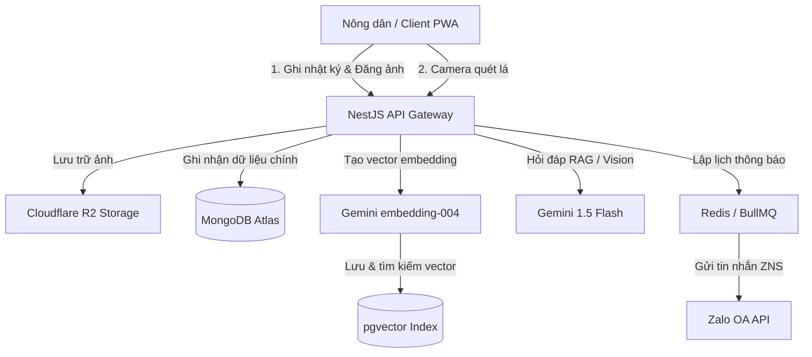

# ĐẶC TẢ YÊU CẦU PHẦN MỀM (SOFTWARE REQUIREMENTS SPECIFICATION - SRS)
## DỰ ÁN: FARMY DIARIES AI — PHÂN TÍCH VÀ ĐẶC TẢ SẢN PHẨM

---

## 1. GIỚI THIỆU (INTRODUCTION)

### 1.1 Mục đích (Purpose)
Tài liệu này đặc tả toàn bộ yêu cầu nghiệp vụ, yêu cầu kỹ thuật, kiến trúc dữ liệu và các giao diện cho hệ thống **Farm Diaries AI**. Tài liệu này đóng vai trò là "Nguồn chân lý" (Source of Truth) cho đội ngũ phát triển, kiểm thử, và làm cơ sở nghiệm thu cho dự án SDN392 Capstone Project.

### 1.2 Phạm vi Sản phẩm (Product Scope)
Farm Diaries AI là ứng dụng Web dạng PWA (Progressive Web App) hỗ trợ nông dân Việt Nam quản lý vụ mùa thông minh. 
*   **Trọng tâm:** Tự động hóa ghi chép nhật ký nông trại, chẩn đoán sâu bệnh cây trồng bằng AI Vision, hỗ trợ hỏi đáp tri thức nông nghiệp qua RAG Chatbot, nhắc nhở thông minh qua Zalo OA và tăng sự tương tác bằng cơ chế nuôi thú ảo.
*   **Ngoài phạm vi (Giai đoạn MVP):** Không hỗ trợ thanh toán trực tuyến thương mại điện tử, không tích hợp phần cứng cảm biến IOT trực tiếp trong ruộng vườn.

---

## 2. TỔNG QUAN HỆ THỐNG (SYSTEM OVERVIEW)

### 2.1 Kiến trúc Stack Công nghệ thực tế (Tech Stack)
Hệ thống được phát triển theo mô hình Client-Server phân tán, cụ thể:
*   **Frontend Client:** React.js + Vite + TypeScript (PWA-first qua `vite-plugin-pwa`), styling bằng Tailwind CSS + Shadcn/UI, quản lý state bằng Zustand và React Query.
*   **Backend Server:** Node.js + NestJS Framework (kiến trúc Module hóa, Dependency Injection).
*   **Primary Database (Lưu trữ chính):** MongoDB Atlas (Mongoose ODM). Lưu trữ toàn bộ dữ liệu nghiệp vụ.
*   **Vector Search Index (Chỉ mục RAG):** pgvector (PostgreSQL extension) dùng duy nhất để lưu các vector embedding phục vụ tìm kiếm ngữ nghĩa, không lưu dữ liệu nghiệp vụ chính.
*   **Cache & Hàng đợi công việc (Queue):** Redis + BullMQ (xử lý lập lịch thông báo Zalo OA ZNS, email và giới hạn tần suất gọi AI).
*   **Lưu trữ đám mây (Cloud Storage):** Cloudflare R2 (S3 API tương thích) lưu trữ hình ảnh nhật ký và ảnh quét sâu bệnh của nông dân.
*   **Nhà cung cấp Danh tính (Auth):** Supabase Authentication.

### 2.2 Sơ đồ Luồng dữ liệu Tổng quan


---

## 3. ĐẶC TẢ CHI TIẾT CÁC PHÂN HỆ CHỨC NĂNG

### 3.1 Phân hệ Nhật ký số & Quản lý vụ mùa (DiaryModule)
Cho phép nông dân tạo các nhật ký số để theo dõi quá trình sinh trưởng của cây trồng theo từng giai đoạn và khu vườn (Farm Plots).

#### 3.1.1 Quy tắc Nghiệp vụ (Business Rules)
*   **Quy tắc một bản ghi:** Mỗi một khu vườn (`farm_plot_id`) tại một ngày (`entry_date`) và một loại cây trồng (`crop_type`) chỉ được phép có tối đa 1 bản ghi nhật ký chính.
*   **Weather Sync:** Hệ thống tự động đính kèm thông tin thời tiết (nhiệt độ, độ ẩm, thời tiết) vào bản ghi nhật ký nếu client gửi kèm tọa độ GPS.
*   **Cloudflare R2 Private Upload:** Ảnh chụp ruộng vườn của nông dân không được hiển thị công khai dạng URL cố định. Hệ thống phải generate pre-signed URL của Cloudflare R2 với thời gian hết hạn (TTL) là 15 phút.

#### 3.1.2 Danh sách API Endpoints
*   `POST /api/v1/diary`
    *   **Mô tả:** Tạo mới một dòng nhật ký nông trại.
    *   **Payload DTO (`CreateDiaryEntryDto`):**
        ```typescript
        export class CreateDiaryEntryDto {
          cropType: string;         // Loại cây (ví dụ: Lúa, Cà chua)
          growthStage?: string;     // Giai đoạn (Cây con, Ra hoa, Thu hoạch)
          notes?: string;           // Ghi chú chi tiết hoạt động
          photoUrls?: string[];     // Array pre-signed URL ảnh
          watered?: boolean;        // Đã tưới nước?
          fertilized?: boolean;     // Đã bón phân?
          weather?: any;            // Nested JSON chứa nhiệt độ, độ ẩm từ client GPS
        }
        ```
    *   **Logic xử lý backend:** Lưu bản ghi vào MongoDB. Kích hoạt sự kiện `diary.created` để gửi tín hiệu cho `PetModule` tăng điểm kinh nghiệm (XP) và streak cho thú cưng ảo của người dùng.
*   `GET /api/v1/diary` (Lấy danh sách nhật ký phân trang theo User)
*   `GET /api/v1/diary/:id` (Xem chi tiết nhật ký)
*   `PUT /api/v1/diary/:id` (Cập nhật nhật ký)
*   `DELETE /api/v1/diary/:id` (Xóa mềm - set `is_deleted = true`)

---

### 3.2 Phân hệ Trợ lý Chẩn đoán sâu bệnh (PlantScanModule)
Tính năng hỗ trợ nông dân chụp ảnh lá cây bị sâu bệnh bằng điện thoại, hệ thống sẽ chẩn đoán tức thời và đưa ra giải pháp điều trị.

#### 3.2.1 Quy trình Xử lý và Thuật toán (Pipeline & Algorithms)
Hệ thống áp dụng quy trình kiểm tra 6 bước nghiêm ngặt để tiết kiệm chi phí và đảm bảo chất lượng ảnh:
1.  **Rate Limiting:** Giới hạn mỗi nông dân chỉ được quét tối đa 3 ảnh/ngày (tài khoản miễn phí) để tránh spam. Lưu counter trong Redis.
2.  **Mime-type & Size Check:** Giới hạn file ảnh tối đa 5MB. Chỉ chấp nhận các định dạng `JPEG`, `PNG`, `WebP`.
3.  **Blur Detection (Nhận diện mờ ảnh):** Sử dụng thư viện Sharp.js phân tích phương sai Laplacian (Laplacian Variance). Nếu giá trị phương sai $< 100$, hệ thống từ chối ảnh và yêu cầu nông dân chụp lại ảnh rõ nét hơn, không gọi sang Gemini Vision API để tránh phí.
4.  **pHash Cache Verification:** Tính toán Perceptual Hash (pHash) của ảnh. Tìm kiếm trong MongoDB xem có ảnh nào của cùng user có khoảng cách Hamming (Hamming Distance) $< 10$ trong vòng 7 ngày qua hay không.
    *   *Nếu trùng khớp (Hit Cache):* Trả ngay kết quả chẩn đoán đã lưu trước đó.
    *   *Nếu không trùng khớp (Miss Cache):* Tiếp tục bước 5.
5.  **R2 Secure Upload:** Upload ảnh gốc lên Cloudflare R2 với tên file ngẫu nhiên đã băm bảo mật.
6.  **Gemini Vision Call:** Gửi ảnh và prompt hệ thống yêu cầu cấu trúc kết quả JSON sang mô hình `gemini-1.5-flash`.

#### 3.2.2 Cấu trúc Kết quả trả về (JSON Response)
```json
{
  "success": true,
  "data": {
    "disease": "Bệnh đạo ôn lá lúa (Pyricularia oryzae)",
    "confidence": 0.94,
    "symptoms": ["Lá xuất hiện vết bệnh hình thoi", "Rìa màu nâu đỏ, tâm màu xám tro"],
    "treatment": {
      "chemical": "Phun thuốc đặc trị chứa hoạt chất Tricyclazole hoặc Fenoxanil",
      "organic": "Hạn chế bón thừa đạm, tháo cạn nước ruộng bị bệnh và rải vôi bột khử trùng",
      "phiWarning": "⚠️ CẢNH BÁO CÁCH LY: Tuyệt đối không thu hoạch lúa trong vòng 14 ngày sau khi phun thuốc!"
    },
    "imageUrl": "https://r2.farmdiaries.vn/scans/userId/disease_hash.jpg?expires=..."
  }
}
```

---

### 3.3 Phân hệ Trợ lý AI Chat & Tri thức RAG (ChatModule & RAG)
Tích hợp chatbot chuyên gia nông nghiệp trả lời câu hỏi trực tiếp của người dùng bằng cách tìm kiếm ngữ nghĩa trên kho tài liệu kỹ thuật nông nghiệp Việt Nam.

#### 3.3.1 Kiến trúc RAG (Retrieval-Augmented Generation)
1.  **Chuẩn bị Dữ liệu (Offline Ingestion):** Quản trị viên tải các tài liệu kỹ thuật trồng trọt lên. Hệ thống chia nhỏ tài liệu (chunking), tạo embedding thông qua mô hình `text-embedding-004` (Gemini API) thành vector 768 chiều. Lưu vector vào bảng `embeddings` của pgvector.
2.  **Truy vấn Ngữ nghĩa (Online Query):**
    *   Nông dân gửi tin nhắn: *"Làm sao trị rầy nâu trên cây bưởi?"*.
    *   Backend chuyển câu hỏi này thành vector embedding 768 chiều.
    *   Thực hiện truy vấn Cosine Similarity trên pgvector:
        ```sql
        SELECT source_id, text, metadata 
        FROM embeddings 
        WHERE source_type = 'knowledge_chunk' 
        ORDER BY embedding <=> $1 LIMIT 3;
        ```
    *   Hệ thống lấy nội dung text tương ứng từ các chunks làm context (ngữ cảnh).
3.  **LLM Generation:** Đưa context và tin nhắn của user vào System Prompt chuẩn để gửi cho Gemini Flash tạo câu trả lời chính xác, tránh hiện tượng ảo tưởng thông tin.

#### 3.3.2 Zalo & Redis Rate Limiting
Để bảo vệ Quota Gemini API (15 RPM đối với gói miễn phí):
*   Khi người dùng gửi tin nhắn, hệ thống kiểm tra số lượng request trong Redis (`chat:limit:{userId}`).
*   Nếu vượt quá hạn mức RPM của hệ thống, request sẽ được xếp vào hàng đợi BullMQ để xử lý bất đồng bộ hoặc thông báo *"Hệ thống AI đang bận, bà con vui lòng đợi vài giây nhé!"*.

---

### 3.4 Phân hệ Thú cưng ảo & Trò chơi hóa (PetModule & Shop)
Phân hệ tăng tính tương tác (Gamification), thúc đẩy nông dân ghi chép nhật ký mỗi ngày.

#### 3.4.1 Cơ chế Trạng thái Thú cưng (Pet State Engine)
Mỗi nông dân có một Mascot thú ảo đồng hành. Tâm trạng (mood) của thú ảo phụ thuộc hoàn toàn vào hành vi của nông dân:
*   **Chuỗi Streak:** Số ngày liên tục ghi nhật ký canh tác của user.
*   **Quy tắc chuyển đổi trạng thái Mood:**
    *   `excited` (Phấn khích): Khi chuỗi Streak đạt mốc 7 ngày, 14 ngày hoặc 30 ngày.
    *   `happy` (Vui vẻ): Nông dân ghi nhật ký canh tác trong vòng 24 giờ qua.
    *   `neutral` (Bình thường): Nông dân chưa ghi nhật ký nông trại quá 24 giờ.
    *   `sad` (Buồn bã): Quá 36 giờ nông dân không cập nhật nhật ký vụ mùa.
    *   `worried` (Lo lắng): Hệ thống vừa ghi nhận kết quả Plant Scan chẩn đoán cây bị bệnh nặng của cùng user.

#### 3.4.2 Đồng bộ Thú ảo sang AI Chat
*   **System Prompt Injection:** Khi người dùng trò chuyện với AI Chat, trạng thái thú cưng (streak_count, mood) sẽ được tự động chèn vào câu lệnh prompt hệ thống. Nhờ đó, trợ lý ảo sẽ chào đón người dùng bằng câu thoại phù hợp:
    *   *Ví dụ (Mood sad):* *"Sao hai ngày nay bạn không ghi nhật ký cho tớ thế? Vườn bưởi vẫn phát triển ổn chứ?"*
*   **Hành động nhanh từ Chatbot:** AI Chat có thể hiển thị các nút hành động nhanh (Quick Action Buttons) như `[📝 Tạo nhật ký nhanh]` để giúp người dùng tương tác ngay tại khung chat, từ đó kích hoạt cập nhật trạng thái pet lập tức.

#### 3.4.3 Cửa hàng phụ kiện thú cưng (Pet Shop)
*   Nông dân kiếm điểm kinh nghiệm (XP) qua các hoạt động: ghi nhật ký (+10 XP), quét lá chẩn đoán (+15 XP), hoàn thành việc cần làm (+5 XP).
*   **Shop Item:** Nông dân dùng điểm XP để mua phụ kiện trang trí cho thú ảo (mũ tai bèo, kính mát, áo mưa...) thông qua API `POST /api/v1/shop/buy` và trang bị chúng lên thú ảo qua `POST /api/v1/shop/equip`.

---

### 3.5 Phân hệ Nhắc nhở & Tích hợp Zalo OA (Reminder & Zalo OA)
Hệ thống lên lịch nhắc nhở nông dân tưới nước, bón phân tự động qua ứng dụng Zalo và thông báo PWA Web Push.

#### 3.5.1 Luồng Tích hợp Zalo Official Account (OA)
1.  Nông dân thực hiện liên kết tài khoản qua Zalo OAuth trên giao diện frontend.
2.  Hệ thống nhận mã ủy quyền, trao đổi lấy `access_token` và `zalo_user_id`, mã hóa `access_token` bằng thuật toán AES-256 trước khi lưu vào MongoDB.
3.  Khi có lịch nhắc nhở: Hệ thống đưa công việc vào hàng đợi **BullMQ**.
4.  Worker của BullMQ lấy job ra và gọi API gửi tin nhắn Zalo ZNS (Zalo Notification Service) theo template đã duyệt:
    *   *Template REMINDER_DIARY:* `"Chủ vườn {{farm_name}} ơi, hôm nay chưa ghi nhật ký cho cây {{crop}} đâu nhé!"`
5.  **Cơ chế Fallback (Dự phòng):** Nếu gửi Zalo thất bại (do hết hạn token hoặc người dùng chặn OA), hệ thống tự động đổi kênh gửi sang thông báo PWA Web Push hoặc gửi email thông báo qua dịch vụ Resend.

---

### 3.6 Phân hệ Báo cáo vụ mùa tuần (InsightModule)
Tự động tổng hợp dữ liệu nông nghiệp của từng hộ dân để đưa ra khuyến nghị hữu ích.

#### 3.6.1 Thuật toán phân rải đều thời gian (Delay Spreading Algorithm)
Vào lúc **Chủ nhật 6:00 AM**, cronjob của hệ thống sẽ quét toàn bộ danh sách nông dân có hoạt động canh tác trong tuần để tạo báo cáo khuyến nghị. 
Vì số lượng người dùng lớn có thể làm sập hạn mức quota gọi AI Gemini (15 RPM đối với gói miễn phí), hệ thống triển khai thuật toán phân rải thời gian trong 4 tiếng (14.400.000 ms):
$$\text{Delay cho user thứ } i = i \times \left( \frac{14,400,000 \text{ ms}}{\text{Tổng số lượng người dùng hoạt động}} \right)$$
Các job tạo báo cáo sẽ được đẩy vào hàng đợi BullMQ với thuộc tính `delay` tương ứng. Điều này đảm bảo hệ thống gọi Gemini API mượt mà, rải đều và không bao giờ gặp lỗi quá tải `429 Too Many Requests`.

---

## 4. THIẾT KẾ CƠ SỞ DỮ LIỆU CHUẨN (DATABASE ARCHITECTURE)

Dự án tuân thủ nghiêm ngặt mô hình **MongoDB-first** làm nguồn dữ liệu nghiệp vụ gốc. pgvector chỉ đóng vai trò làm chỉ mục vector.

### 4.1 Cấu trúc các collections trong MongoDB

#### 4.1.1 Collection `users`
Lưu trữ thông tin tài khoản nông dân và cấu hình nhận thông báo.
```typescript
{
  _id: string;                               // UUID v4
  email: string;                             // Unique, email đăng ký
  passwordHash: string;                      // Mật khẩu đã băm bcrypt
  role: 'user' | 'admin' | 'moderator';      // Phân quyền tài khoản
  full_name: string;                         // Tên đầy đủ
  location?: string;                         // Địa chỉ tỉnh/thành
  zalo_user_id?: string;                     // ID người dùng trên hệ thống Zalo
  zalo_access_token_encrypted?: string;      // Token zalo mã hóa AES-256
  zalo_notification_enabled: boolean;        // Cho phép nhận tin nhắn Zalo
  push_subscription?: any;                   // Cấu hình push notification PWA
  created_at: Date;
  updated_at: Date;
}
```

#### 4.1.2 Collection `farm_plots`
Lưu trữ danh sách các khu vườn của nông dân.
```typescript
{
  _id: string;                               // UUID v4
  user_id: string;                           // Tham chiếu sang users._id
  name: string;                              // Tên khu vườn (Ví dụ: Vườn Cam Phía Tây)
  area_size: number;                         // Diện tích vườn (m2)
  description?: string;                      // Ghi chú chi tiết khu vườn
  created_at: Date;
}
```

#### 4.1.3 Collection `diaries`
Lưu vụ mùa canh tác đang diễn ra tại các khu vườn.
```typescript
{
  _id: string;                               // UUID v4
  plot_id: string;                           // Tham chiếu sang farm_plots._id
  crop_type: string;                         // Loại cây canh tác chính
  start_date: Date;                          // Ngày bắt đầu vụ mùa
  status: 'active' | 'completed' | 'abandoned';
  metadata?: {
    source?: string;
    batch_no?: string;
  };
  created_at: Date;
}
```

#### 4.1.4 Collection `diary_logs`
Lưu nhật ký chăm sóc nông nghiệp hàng ngày của từng vụ mùa.
```typescript
{
  _id: string;                               // UUID v4
  diary_id: string;                          // Tham chiếu sang diaries._id
  activity_type: string;                     // Loại hoạt động (Tưới nước, Bón phân, Xịt thuốc...)
  content: string;                           // Nội dung mô tả chi tiết hoạt động
  photo_urls?: string[];                     // Các link ảnh R2 đính kèm
  watered?: boolean;
  fertilized?: boolean;
  weather?: {                                // Lưu trữ thông tin thời tiết đồng bộ
    temp?: number;
    humidity?: number;
    description?: string;
  };
  created_at: Date;
}
```

#### 4.1.5 Collection `pet_states`
Lưu trạng thái của Mascot thú cưng ảo của từng nông dân.
```typescript
{
  _id: string;
  user_id: string;                           // Unique, tham chiếu users._id
  mood: 'happy' | 'neutral' | 'sad' | 'worried' | 'excited';
  streak_count: number;                      // Số ngày liên tục cập nhật nhật ký
  xp: number;                                // Điểm kinh nghiệm tích lũy
  level: number;                             // Cấp độ thú cưng
  equipped_items: string[];                  // Danh sách ID phụ kiện đang mặc
  last_diary_at?: Date;                      // Lần cuối ghi nhật ký
  mood_reason?: string;                      // Lý do trạng thái tâm trạng đổi
  updated_at: Date;
}
```

#### 4.1.6 Collection `plant_scans`
Lưu lịch sử chẩn đoán bệnh từ camera quét lá cây của nông dân.
```typescript
{
  _id: string;
  user_id: string;                           // Tham chiếu users._id
  imageUrl: string;                          // Ảnh lưu trữ trên Cloudflare R2
  pHash: string;                             // Khóa băm nhận diện trùng ảnh
  cropType: string;                          // Loại cây quét bệnh
  diagnosis: {
    disease: string;                         // Tên bệnh AI phát hiện
    confidence: number;                      // Độ chính xác (0.0 -> 1.0)
    symptoms: string[];                      // Triệu chứng
    treatment: {
      chemical: string;                      // Giải pháp hóa học
      organic: string;                       // Giải pháp sinh học
      phiWarning: string;                    // Cảnh báo cách ly phun thuốc
    };
  };
  modelUsed: string;                         // Phiên bản mô hình (ví dụ: gemini-1.5-flash)
  userConfirmed?: boolean;                   // Nông dân xác nhận đúng/sai
  createdAt: Date;
}
```

---

### 4.2 Chỉ mục tìm kiếm vector trên PostgreSQL/pgvector
Tên bảng: `embeddings` (Chỉ dùng để RAG và Semantic Search, không lưu dữ liệu nghiệp vụ chính).
```sql
CREATE TABLE embeddings (
  id           BIGSERIAL PRIMARY KEY,
  source_id    TEXT NOT NULL,                -- Tham chiếu sang ID của MongoDB (Dạng chuỗi)
  source_type  TEXT NOT NULL,                -- Phân loại: 'diary_entry' | 'knowledge_chunk'
  chunk_index  INT NOT NULL DEFAULT 0,       -- Thứ tự chunk tài liệu
  text         TEXT NOT NULL,                -- Đoạn văn bản tri thức gốc
  content_hash TEXT,                         -- Mã băm nội dung để so khớp thay đổi
  embedding    vector(768),                  -- Vector nhúng 768 chiều (Gemini)
  metadata     JSONB DEFAULT '{}',           -- Metadata lọc nhanh (ví dụ: { cropType: 'lúa' })
  is_active    BOOLEAN DEFAULT TRUE,         -- Đánh dấu hoạt động
  created_at   TIMESTAMPTZ DEFAULT now()
);

-- Tạo chỉ mục HNSW phục vụ tìm kiếm khoảng cách Cosine nhanh dưới 10ms
CREATE INDEX IF NOT EXISTS embeddings_hnsw_cosine_idx
  ON embeddings
  USING hnsw (embedding vector_cosine_ops)
  WITH (m = 16, ef_construction = 64);
```

---

## 5. YÊU CẦU PHI CHỨC NĂNG (NON-FUNCTIONAL REQUIREMENTS)

### 5.1 Bảo mật & An toàn dữ liệu (Security)
*   **Mã hóa mật khẩu:** Băm mật khẩu người dùng bằng bcrypt với salt rounds = 10.
*   **Mã hóa Token:** Toàn bộ access token truy cập API của bên thứ ba (Zalo OA) phải được mã hóa trước khi lưu bằng thuật toán mã hóa đối xứng AES-256-GCM.
*   **An toàn Tải ảnh:**
    *   Chỉ cho phép upload hình ảnh trực tiếp lên Cloudflare R2 qua Pre-signed URL.
    *   Backend bắt buộc kiểm tra Magic Bytes của ảnh để chống tải lên mã độc giả mạo đuôi mở rộng.
*   **Phân quyền Endpoint (RBAC):** Toàn bộ API nghiệp vụ cần được bảo vệ bởi JwtAuthGuard. Chỉ có tài khoản có quyền `admin` mới được thêm/sửa cơ sở tri thức nông nghiệp.

### 5.2 Hiệu năng & Khả năng chịu tải (Performance & Scalability)
*   **Tốc độ phản hồi:** Thời gian phản hồi API nghiệp vụ thông thường (không gọi AI) phải đạt $< 200\text{ms}$ ở phân vị thứ 95 (p95).
*   **Tìm kiếm RAG:** Thời gian truy vấn tìm kiếm vector láng giềng gần nhất trên pgvector HNSW index phải đạt $< 20\text{ms}$.
*   **Rate limit AI:** Hệ thống phải đảm bảo không bao giờ gặp lỗi quá tải `429` của Gemini API bằng cách phân tải thông minh qua hàng đợi BullMQ trong Redis.

### 5.3 Tính khả dụng (Availability & Usability)
*   **Thiết kế Offline-First:** Ứng dụng PWA hỗ trợ cache tĩnh tài nguyên giao diện, cho phép nông dân mở app và xem nhật ký cũ ngay cả khi đi vào vùng ruộng sâu không có sóng 3G/4G.
*   **Giao diện Thân thiện:** Sử dụng font chữ to, dễ đọc (Inter / Roboto), tương phản cao, nút nhấn lớn phù hợp cho thao tác nhanh ngoài trời của bà con nông dân.
